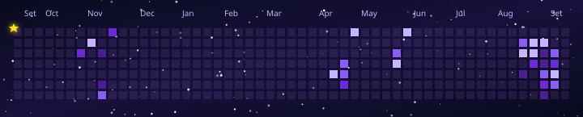

# ✦⋆· 𝐆𝐢𝐭𝐒𝐭𝐚𝐫 ·⋆✦

## 𝑨 𝒔𝒕𝒂𝒓-𝒕𝒉𝒆𝒎𝒆𝒅 𝑮𝒊𝒕𝑯𝒖𝒃 𝒄𝒐𝒏𝒕𝒓𝒊𝒃𝒖𝒕𝒊𝒐𝒏 𝒈𝒓𝒂𝒑𝒉 𝒈𝒆𝒏𝒆𝒓𝒂𝒕𝒆𝒅 𝒂𝒔 𝒂𝒏 𝑺𝑽𝑮.

<p align="center">
  
</p>

## 𝑨𝒃𝒐𝒖𝒕
✧ GitStar is a small TypeScript project that transforms a GitHub contribution graph into an animated starry scene.

✧ A glowing star travels across the contribution grid, highlighting cells as it passes through them, while background stars gently twinkle.

## 𝑾𝒉𝒚 𝑮𝒊𝒕𝑺𝒕𝒂𝒓?
✧ I wanted to experiment with SVG animations and create something a little more fun than a traditional contribution graph.

✧ The project started with the idea to bring a little more light to the GitHub profiles of those who choose to use GitStar.

## 𝑭𝒆𝒂𝒕𝒖𝒓𝒆𝒔

✧ Animated GitHub contribution graph

✧ Star traveling across the contribution grid

✧ Glowing contribution cells

✧ Twinkling background stars

✧ Animated SVG output

✧ 200 Randomized star paths

✧ Contribution intensity represented by different colors

## 𝑮𝒆𝒕𝒕𝒊𝒏𝒈 𝑺𝒕𝒂𝒓𝒕𝒆𝒅

### ✦ 𝑷𝒓𝒆𝒓𝒆𝒒𝒖𝒊𝒔𝒊𝒕𝒆𝒔

✧ Node.js

✧ npm

✧ A GitHub Personal Access Token

### ✦ 𝟏. 𝑪𝒍𝒐𝒏𝒆 𝒕𝒉𝒆 𝒓𝒆𝒑𝒐𝒔𝒊𝒕𝒐𝒓𝒚

``` bash
git clone https://github.com/0Isabella/GitStar.git
cd GitStar
```

### ✦ 𝟐. 𝑰𝒏𝒔𝒕𝒂𝒍𝒍 𝒅𝒆𝒑𝒆𝒏𝒅𝒆𝒏𝒄𝒊𝒆𝒔

``` bash
npm install
```

### ✦ 𝟑. 𝑪𝒐𝒏𝒇𝒊𝒈𝒖𝒓𝒆 𝒚𝒐𝒖𝒓 𝑮𝒊𝒕𝑯𝒖𝒃 𝒕𝒐𝒌𝒆𝒏

✧ Create a .env file and add your GitHub Personal Access Token.

✧ **Don't** share your token or commit the `.env` file containing it.

``` env
GITHUB_TOKEN=your_token_here
GITHUB_USERNAME=your_username_here
```

### ✦ 𝟒. 𝑹𝒖𝒏 𝒕𝒉𝒆 𝒑𝒓𝒐𝒋𝒆𝒄𝒕

``` bash
npm run build
npm start
```

✧ The generated SVG will be available at `"output/gitstar.svg"`

## 𝑫𝒊𝒔𝒑𝒍𝒂𝒚𝒊𝒏𝒈 𝑮𝒊𝒕𝑺𝒕𝒂𝒓 𝒊𝒏 𝒚𝒐𝒖𝒓 𝑮𝒊𝒕𝑯𝒖𝒃 𝒑𝒓𝒐𝒇𝒊𝒍𝒆 𝑹𝑬𝑨𝑫𝑴𝑬

✧ Once the repository is ready, all you need to do is to add this HTML in your README, replacing `YOUR_USERNAME` with your GitHub username.

```html
<p align="center">
  
</p>
```

## 𝑩𝒖𝒊𝒍𝒅 𝑾𝒊𝒕𝒉

✧ TypeScript

✧ Node.js

✧ GitHub GraphQL API

✧ SVG

## 𝑺𝒕𝒓𝒖𝒄𝒕𝒖𝒓𝒆

```
GitStar
├── output/
│   └── gitstar.svg
├── src/
│   ├── animation.ts
│   ├── github.ts
│   ├── graph.ts
│   └── index.ts
├── .gitignore
├── package-lock.json
├── package.json
├── README.md
└── tsconfig.json
```

## 𝑪𝒓𝒆𝒅𝒊𝒕𝒔

✧ If you use GitStar, please keep a link to this repository as credit
 [GitStar](https://github.com/0Isabella/GitStar)